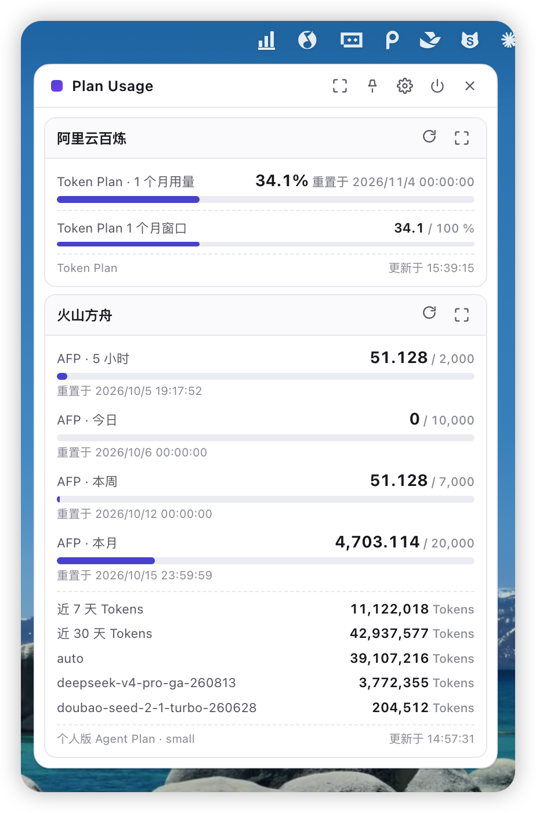
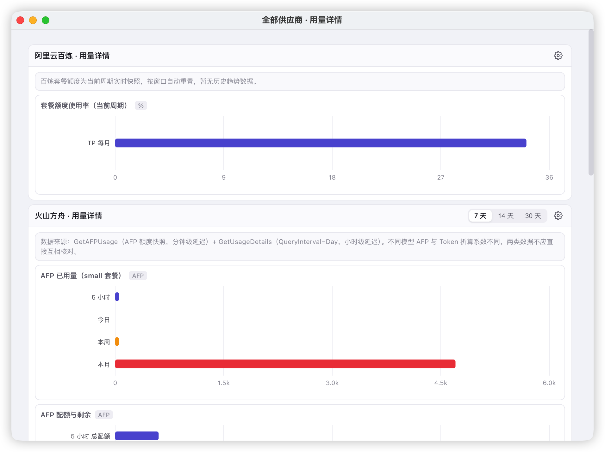
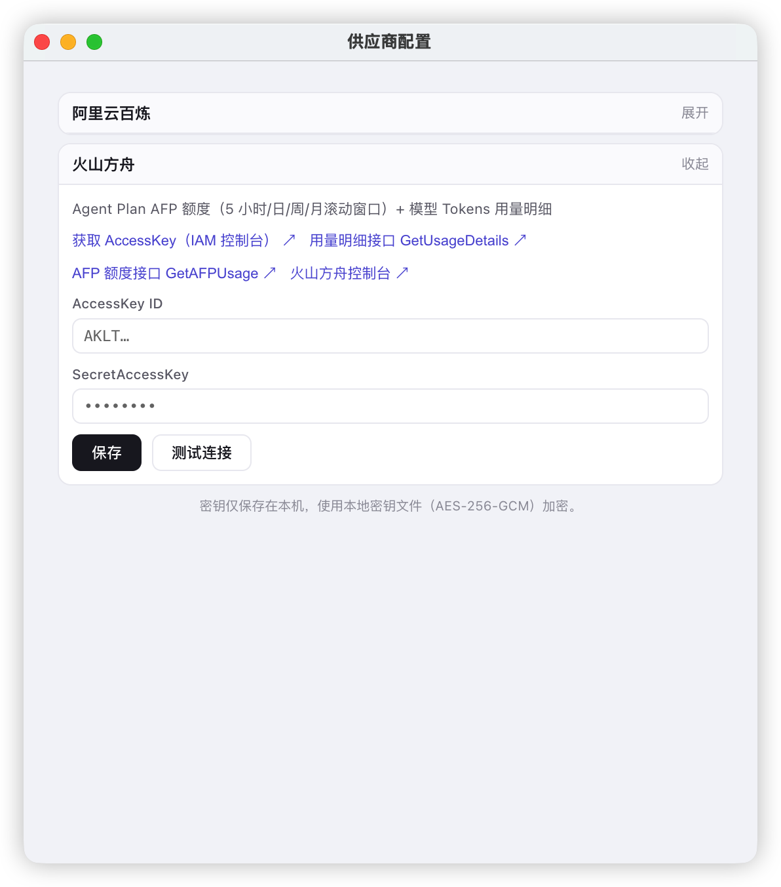

# Plan Usage

**AI 套餐额度，常驻菜单栏。** 实时监控阿里云百炼 / 火山方舟等 AI 服务商的 Credits、Tokens、AFP 配额余量与重置时间，再也不用登录控制台翻用量页面。

> A macOS menu bar app that tracks your AI coding-plan quotas in real time — remaining **Credits / Tokens / AFP**, reset timers and per-model usage for **Aliyun Bailian (Model Studio)** and **Volcengine Ark**. Keys are encrypted locally with AES-256-GCM and never leave your machine.

<p align="center">
  
  
  
  
  
  
</p>

<p align="center">
  
</p>

## 为什么需要它

- 买了 Coding Plan / Agent Plan，却总在**被限流之后**才发现额度用光；
- 查一次用量要登录控制台、翻页刷新，模型维度的消耗更是无从下手；
- 同时在用多家服务商（百炼 + 方舟 + …），没有一个统一入口。

点开菜单栏图标即可看到：各套餐**滚动窗口已用百分比、配额重置时间、按模型 Token 消耗**，详情窗口还有按天趋势图。

## 功能特性

- **菜单栏弹窗概览**：每个服务商一张卡片，进度条 + 重置倒计时一目了然；弹窗可钉住（pin）、自动调节高度
- **滚动窗口监控**：火山方舟 AFP 的 5 小时 / 今日 / 本周 / 本月配额，百炼 Token Plan / Coding Plan 的周期用量
- **用量详情图表**：按天 Token 趋势、AFP 配额 vs 已用、按模型占比（recharts 面积图 / 条形图 / 饼图），支持 7 / 14 / 30 天切换
- **应用内一键登录**：百炼内置 CLI 控制台授权，无需手动粘贴密钥；方舟填入 AccessKey 即可，支持"测试连接"即时校验
- **本地加密、零上传**：密钥以 AES-256-GCM 加密存储于本机（密钥文件权限 0600），请求直连官方 OpenAPI，无任何遥测或中转服务器
- **打开即有数据**：主进程 15s TTL 缓存 + 磁盘快照首屏渲染，后台静默刷新不阻塞 UI
- **插件式架构**：实现一个 `ProviderAdapter` 接口并注册，新服务商的卡片、表单、图表全部由数据驱动自动渲染

## 支持的服务商

| 服务商 | 套餐 | 可见数据 | 接入方式 |
|---|---|---|---|
| [阿里云百炼](https://bailian.console.aliyun.com/) (Model Studio) | Token Plan / Coding Plan | 席位 Credits 余量、周期用量百分比、重置时间、模型账单 | 应用内登录（内置 [bailian-cli](https://www.npmjs.com/package/bailian-cli)） |
| [火山方舟](https://console.volcengine.com/ark) (Volcengine Ark) | Agent Plan 个人版（Small/Medium/Large/Max） | AFP 5 小时/今日/本周/本月配额、近 7/30 天及各模型 Tokens | AccessKey（IAM 控制台签发） |

更多服务商支持中，欢迎提 Issue 点名或提交 PR —— 参见[接入新服务商](#接入新服务商)。

## 界面预览

<table>
  <tr>
    <td width="50%"></td>
    <td width="50%"></td>
  </tr>
  <tr>
    <td align="center"><b>用量详情</b> — 按天趋势 / 配额对比 / 模型占比</td>
    <td align="center"><b>供应商配置</b> — 表单由适配器元数据自动生成</td>
  </tr>
</table>

## 安全与隐私

- AccessKey / SecretAccessKey 仅保存在 `~/Library/Application Support/Plan Usage/`，字段值以 **AES-256-GCM** 加密（随机 IV + 认证标签），密钥文件首次运行随机生成、权限 `0600`
- 所有请求由本机直连阿里云 / 火山引擎官方 OpenAPI 端点，签名算法（`ACS3-HMAC-SHA256`、火山 SigV4 风格）在本地实现，见 [src/main/providers/signing/](src/main/providers/signing)
- 无账号体系、无遥测、无第三方服务器

## 快速开始

环境要求：macOS、Node.js ≥ 20。

```bash
git clone https://github.com/Lamborshea/plan-usage-app.git
cd plan-usage-app
npm install

npm run dev          # 开发模式（热更新）
npm run build:mac    # 打包 .dmg / .zip，产物在 release/
npm run typecheck    # 类型检查
```

首次启动后点击菜单栏图标，在弹窗中完成百炼登录或填写火山方舟 AccessKey 即可开始监控。

<details>
<summary><b>获取各服务商凭证</b></summary>

- **阿里云百炼**：弹窗内点击登录，会自动唤起内置 bailian-cli 的控制台授权流程（需为登录账号授予 Token Plan 查询权限）
- **火山方舟**：在 [IAM 控制台](https://console.volcengine.com/iam) 创建 AccessKey，填入应用的供应商配置页；若提示无权限，需为子账号挂载方舟用量查询权限

接口细节与字段说明归档在 [docs/bailian.md](docs/bailian.md)、[docs/volcengine.md](docs/volcengine.md)。
</details>

## 项目结构

```
src/
  main/            # Electron 主进程：托盘、窗口、IPC、缓存
    providers/     # 服务商适配器（阿里云百炼、火山方舟）
      signing/     # 官方 OpenAPI 签名实现（ACS3 / 火山 SigV4）
  preload/         # contextBridge 安全桥接
  renderer/        # React 渲染进程：概览 / 详情 / 设置，全部数据驱动
  shared/          # 主进程与渲染进程共享的类型契约（UI 的唯一事实来源）
docs/              # 服务商 API 文档归档
```

### 接入新服务商

1. 在 `src/main/providers/` 新建适配器，实现 [`ProviderAdapter`](src/main/providers/types.ts)：

```ts
export interface ProviderAdapter {
  meta: ProviderMeta                              // 名称、表单字段、帮助链接
  fetchSummary(config): Promise<UsageSummary>     // 概览卡片：指标 + 配额行
  fetchDetail(config, days): Promise<UsageDetail> // 详情图表：面积/条形/饼图
  login?(): Promise<string>                       // 可选：交互式授权登录
}
```

2. 在 [src/main/providers/index.ts](src/main/providers/index.ts) 的注册表中加入该适配器；
3. 完成 —— 概览卡片、配置表单、详情图表均由 `shared/types.ts` 契约自动渲染，无需改动任何 UI 代码。

## Roadmap

- [ ] 更多 AI 服务商适配器（DeepSeek / 智谱 / Kimi / MiniMax 等，欢迎 Issue 投票）
- [ ] 额度阈值提醒（系统通知"剩余 Credits 不足 10%"）
- [ ] Windows / Linux 托盘支持
- [ ] GitHub Actions 自动构建与 Release 分发

## 参与贡献

Fork → 新建分支 → `npm run typecheck` 通过 → 提 PR。新服务商适配器、翻译、UI 改进都非常欢迎，提 Issue 反馈问题同样有帮助。

如果这个项目帮你避免了"额度用爆才发现"，点个 **Star** 支持一下。

## License

[MIT](LICENSE)
